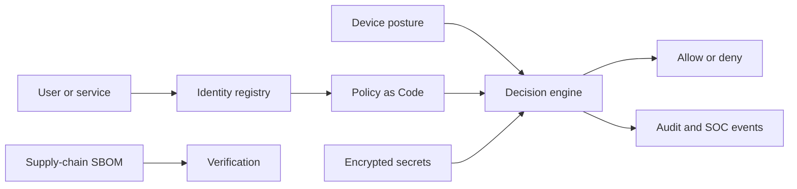
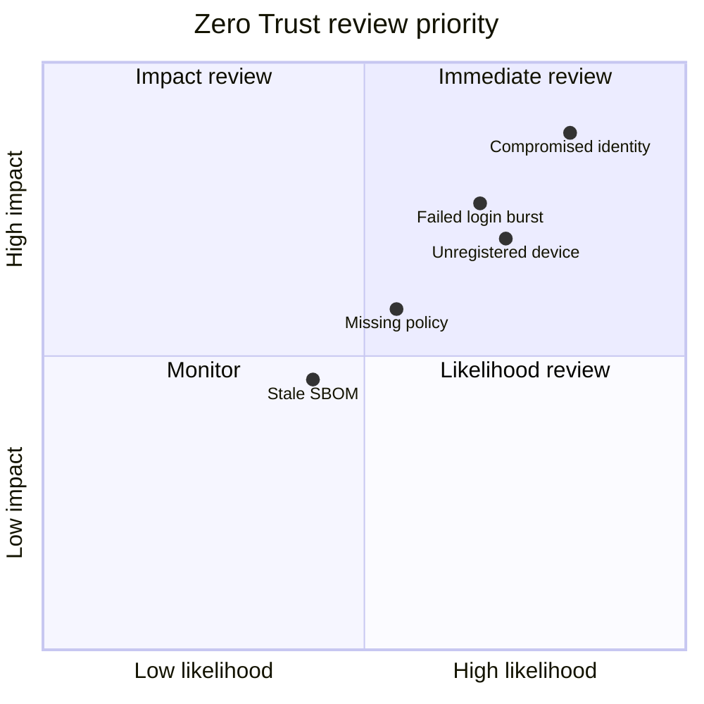

# SafeStack Zero Trust

Local-first policy decision engine for devices, users, resources and actions.
It applies **default deny**, checks device posture, records every decision in
SQLite, and provides an Ed25519 signing foundation for policy bundles.

## Components

The platform includes the Zero Trust decision engine and the [SafeStack Identity](docs/IDENTITY.md) registry.

## Quick start

```bash
python3 -m venv .venv && .venv/bin/pip install -e .
.venv/bin/safestack-zt device-add --id laptop-1 --name laptop --owner alice --posture compliant
.venv/bin/safestack-zt policy-add --effect allow --subject alice --resource vpn --action connect --min-posture compliant
.venv/bin/safestack-zt authorize --device laptop-1 --subject alice --resource vpn --action connect
```

An authorization failure exits with code 2. This MVP does not change firewall
rules or grant OS privileges. See [THREAT-MODEL.md](docs/THREAT-MODEL.md).

## Architecture



## X/Y risk view

The X axis represents likelihood and the Y axis represents impact. Items in the
upper-right quadrant deserve the earliest review.




## License

Released under the [MIT License](LICENSE).
